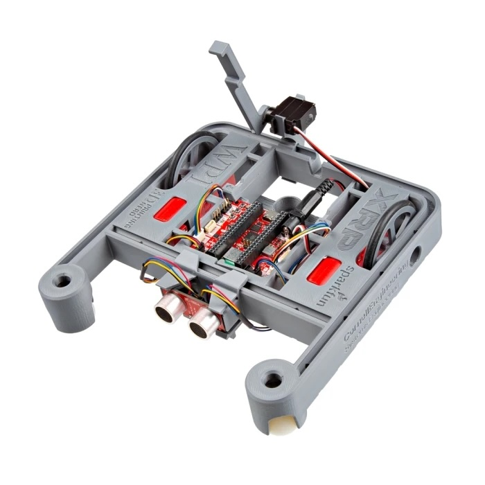

# FRC Programming Overview

The WPILib programming framework allows students to control FRC robots from a
laptop using Command-based controls. In this course, we will learn using the XRP
(eXperiential Robotics Platform) which is able to model a real FRC robot using
the WPILib simulator. You will be writing actual FRC code, and it will be
controlling your robot. By the end you will have a basic understanding of FRC
programming and what it takes to successfully control and operate an actual FRC
robot.

# FRC Control system

The following diagram roughly shows the overall system in an FRC robot.

The system starts with a Robot, which contains a microcontroller and a radio,
along with all other things that are used to control the robot (motors, sensors,
etc).

On the other end is a laptop, with a controller. This is how the human players
direct and control the robot.

We primarily write code that runs on the robot in the Microcontroller. This
class will focus on that code.

## Microcontroller

At the heart of the robot is the microcontroller. In 2026, this controller is
the RoboRio 2.0. In 2027 it will be a different controller (system core), but
the purpose is the same. 

The microcontroller is the "brains" of the system. This is the device that is
running your Java program, and decides how the motors on the robot will behave
given the inputs to it.

Inputs consist of sensors such as cameras, encoders, diagnostics, etc. The most
important input is the human input, which comes from the *Driver station*.

The microcontroller is connected to the Radio, a WiFi connected access point
which allows the robot to communicate with the Driver Station, and in an FRC
event match, with the Field Management System. The radio is installed on the
robot, along with the microcontroller. These are connected using an Ethernet
cable.

## Driver station

The driver station is software provided by First, which connects to the Radio
via a wifi signal or an ethernet cable connected to the Field Management System.

This software is not modifiable by teams, so it exists solely as an interface to
the controllers and the robot. It typically runs on a laptop (but can run on any
windows-based computer).

The controller is an input device which allows a human to give commands to the
robot via buttons and analog controls (joysticks and triggers). Multiple
controllers can be used, and even custom-built controllers can be used!

The driver station on the laptop also has some safety features which are
important to discuss. An FRC robot weighs as much as a small person (100+ lbs),
and has extremely powerful motors! These motors can injure a person who is
nearby, or damage parts of the robot if allowed to move past safe limits.

In the event you need to remove all power to all motors on the robot, you can
trigger an *Emergency Stop*. When running directly from the driver station, this
is done with the spacebar on the keyboard of the laptop. When in competition, a
dedicated red button is provided by the venue.

# The Java program

Inside the microcontroller, a Java program is executing. This program is
executing from the time the microcontroller boots, to the time it is shut down.
Even when the robot is not enabled or moving, the program is still executing.

## Robot state

The code has 3 normal states:
* Disabled - The robot always starts off disabled. When disabled, the robot
  cannot accept inputs, and does not run any motors. When the robot is disabled,
  the Robot Status Light is on solid, and it is safe to be around the robot
  (with safety glasses).
* Autonomous - When in autonomous mode, human inputs are disabled, but the robot
  can execute a preprogrammed sequence of commands. When in Autonomous mode, the
  RSL will be flashing, and the robot can move motors and read sensors.
* Teleoperated - Teleop for short, the robot is being controlled by the human
  using the driver station. Again, the RSL will be flashing to indicate the
  robot is able to move and operate end effectors. Even if the robot is NOT
  moving, if the light is flashing, it is not safe to touch!

The WPILib framework ensures safety by only operating with approved motors,
which can only operate when the robot is *enabled*. When a robot is enabled, it
will have a *flashing* Robot Status Light. When it is on, but *disabled*, it will
have a *solid* RSL.

## Emergency stop

When the robot is emergency stopped, your java program is put into a state where
the robot will stop operating until the Microcontroller is restarted. This is
for safety reasons, and cannot be overridden.

## Parts of an FRC program

Almost all FRC programs consist of the same basic pieces - Initialization, Event
loop, Subsystems, and Commands.

### Initialization

When the robot first boots, it must configure all devices and connect to the
driver station. During initialization, Motors cannot move because the robot is
disabled. However, they can be programmed with configuration options.

The commands and autonomous systems also are created. Logic to connect your
controllers to robot commands are established.

In this phase, all the objects that control the robot are created. Some are
created by WPILib, and some are created by your program.

### Event loop

Because a robot is dealing with real-world physical items, instantaneous action
is never exact. A motor can be told to spin at 1000 RPM, but this doesn't mean
it will instantly be spinning that fast. It takes time to get the motor
spinning, due to physics (momentum). Similarly, there may be forces that move
the pieces of the robot that aren't motors (gravity, collisions with other
robots). For this reason, robot programming is done in a loop called the *event
loop*.

The event loop runs 50 times a second (50 Hz). Each time through the event loop,
the robot code does 4 things:

1. Read inputs, sensors, controller buttons and analog stick values, other
   values from the driver station (e.g. which auto command should be run),
   information from the FMS, etc.
2. Based on the inputs, trigger events. Events decide what to do based on the
   commands that have been established. Did a button get pushed that starts a
   command? Did a timeout event happen? Did the robot change to teleop mode?
3. Execute the current commands.
4. Execute periodic functions in subsystems.

### Subsystem

A subsystem is an object which represents a physical part of your robot. You can
decide how complicated or simple your subsystem can be. For example, the drive
subsystem controls how your robot moves itself around the field.

Subsystems are always running every event loop. Each subsystem has a `periodic`
method which can check sensors, move motors, record data, adjust system state,
etc.

Subsystems also provide a container for methods that control that part of the
robot. For example, a method to spin a drive motor at a specific speed could be
in the subsystem.

You might have multiple instances of a specific subsystem. For example, a Drive
subsystem might have multiple Swerve Module subsystems, each of which controls a
specific swerve wheel on the robot.

### Commands

A command is a declaration of what should happen when an event occurs. For
example, when the "B" button is pressed on the controller, spin the shooter up
to 5000 RPM and then turn on the feeder to feed the game piece into the shooter
and (hopefully) into its target.

A command is something that logically lives *outside* the event loop. It gets
initialized when an event occurs, and is executed each event loop until the
command is cancelled or ends on its own. The command objects might be created
during initialization, or maybe they are created during execution to handle a
specific part of the program.

For our example of shooting, the first event loop where the trigger occurs (B
button pushed), the shooter is told to turn at 100%. In subsequent event loops,
the shooter encoder input is checked to see what the current speed is. Once the
speed reaches 5000 RPM, then the feeder motor is told to turn at a set speed.
This might happen 1 second later, which means 50 event loops have passed. Then
after spinning the feeder for a set amount of time, the command can end with a
reasonable assumption that the game piece is launched.

At the same time other commands might execute. For example, the intake might
also be asked to run. Or the Drive motors might be controlled by the human to
move in a certain way. All of these commands are running simultaneously and
independently. But they all are executed by the event loop.

# The XRP system

The XRP system is a small microcontroller attached to a few motors and sensors
which allows us to inexpensively experiment with FRC robot programming. The XRP
system has several inputs and output controllers, and comes with the following
hardware:

1. 2 motors with encoders
2. 1 IMU (gyro)
3. 1 LED
4. 1 pushbutton
5. 1 rangefinder (proximity sensor)
6. 1 line following sensor
7. 1 WiFi radio

## XRP FRC programming

The XRP is not powerful enough to run Java on board. Therefore, the way we can
run our code is to run it in the WPILib simulator (included in WPILib
installation). The underlying controls are sent to the XRP wirelessly, and the
XRP executes controls on behalf of the Java code running on your computer.

Because of this, the precision of the event loop execution is not quite as good
as a real FRC robot. But it is good enough to learn with!

## XRP imaging

Follow the [instructions on WPILib](https://docs.wpilib.org/en/stable/docs/xrp-robot/hardware-and-imaging.html)
to image your XRP with the FRC-compatible program. The XRP by default comes with
a programming system that is not FRC-related.

## IMU calibration

The IMU is calibrated on startup. This calibration is extremely sensitive to
movement. Most frequently you are turning on power to the XRP while holding it,
and then setting it down. This will result in the IMU behaving erratically, and
being basically unusable.

To correct this, turn the power on, then set the XRP unit down. While
stationary, press and release the RESET button. This will restart the XRP while
it is motionless. The calibration then can be reasonably accurate and the gyro
will be useful for programming.

## Creating an XRP project

Follow the [instructions on WPILib](https://docs.wpilib.org/en/stable/docs/xrp-robot/programming-xrp.html)
to create your first project using the XRP template. We will not repeat all
those instructions here, the goal is to make a program that tests the full
connectivity and assembly of your robot.

# Summary

At this point, you have a general overview of FRC programming, and you have a
working XRP robot to start working on to program using WPILib. In the next
lesson we will learn the structure of the template, and add some new code.

---

[Next: Programming the XRP using WPILib](../lesson2/README.md)
